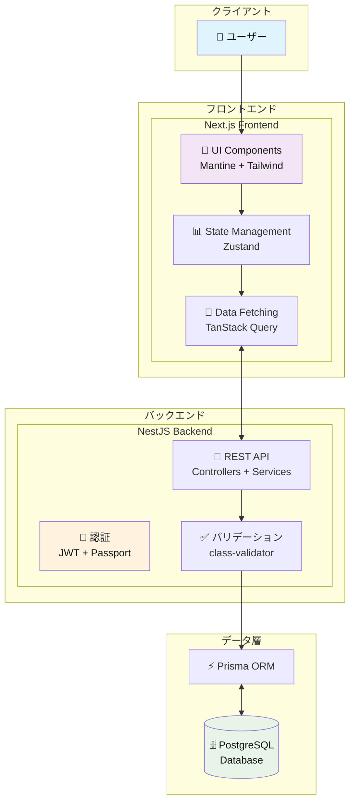

# TaskManager

フルスタックタスク管理アプリケーション

## 概要

TaskManager は、NestJS と Next.js を使用して構築されたモダンなタスク管理アプリケーションです。ユーザー認証、タスクの作成・編集・削除機能を提供し、直感的な UI でタスクを効率的に管理できます。

## Frontend

- **フレームワーク**: Next.js 15.4.5 + React 19
- **UI ライブラリ**: Mantine + Tailwind CSS
- **状態管理**: Zustand
- **データフェッチング**: TanStack React Query + Axios
- **フォーム管理**: Mantine Form + Yup
- **アイコン**: Heroicons + Tabler Icons
- **セキュリティ**: DOMPurify（XSS 対策）

モダンな React ベースの SPA で、レスポンシブデザインと豊富な UI コンポーネントを活用したユーザーフレンドリーなインターフェースを提供します。

## Backend

- **フレームワーク**: NestJS 11
- **データベース**: PostgreSQL + Prisma ORM
- **認証**: JWT + Passport
- **セキュリティ**: bcrypt（パスワードハッシュ化）、CSRF 保護
- **バリデーション**: class-validator + class-transformer
- **開発**: TypeScript + Jest（テスト）

スケーラブルな RESTful API を提供し、型安全性とセキュリティを重視したアーキテクチャで設計されています。

## システム構成図

## 主な機能

- 🔐 ユーザー認証（JWT）
- ✅ タスクの作成・編集・削除
- 👤 ユーザープロフィール管理
- 🛡️ セキュアな認証・認可
- 📱 レスポンシブデザイン
- 🔄 自動データ更新

## 技術スタック

| カテゴリ       | Frontend               | Backend             |
| -------------- | ---------------------- | ------------------- |
| 言語           | TypeScript             | TypeScript          |
| フレームワーク | Next.js                | NestJS              |
| UI             | Mantine + Tailwind CSS | -                   |
| 状態管理       | Zustand                | -                   |
| データベース   | -                      | PostgreSQL + Prisma |
| 認証           | -                      | JWT + Passport      |
| テスト         | -                      | Jest                |
