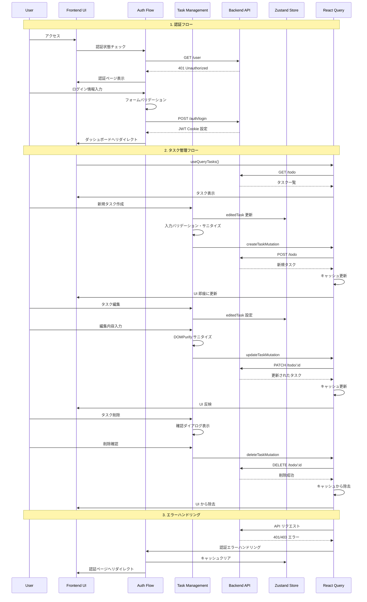
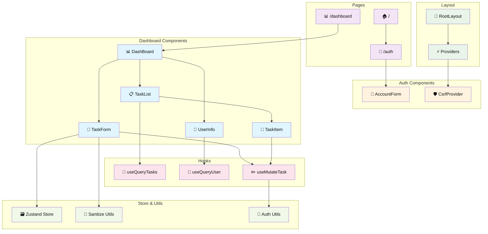

# TaskManager Frontend

<p align="center">
  
  
</p>

<p align="center">TaskManager フロントエンド - Next.js で構築されたモダンなタスク管理 UI</p>

## 概要

TaskManager Frontend は、直感的で使いやすいタスク管理インターフェースを提供するモダンな Web アプリケーションです。Next.js 15 の App Router と React 19 を使用し、Mantine UI コンポーネントと Tailwind CSS でスタイリングされています。リアルタイムなデータ同期、セキュアな認証、レスポンシブデザインを特徴とし、効率的なタスク管理体験を実現します。

## 機能

### 🔐 認証機能

- **ユーザー登録**: バリデーション付きの新規アカウント作成
- **ログイン**: セキュアな認証システム
- **認証状態管理**: JWT ベースの自動ログイン維持
- **ログアウト**: セキュアなセッション終了
- **エラーハンドリング**: 認証エラーの適切な表示と処理

### ✅ タスク管理機能

- **タスク作成**: タイトルと説明を含む新規タスク作成
- **タスク一覧表示**: ユーザー固有のタスク一覧を時系列順で表示
- **タスク編集**: 既存タスクのインライン編集
- **タスク削除**: 確認ダイアログ付きの安全な削除
- **リアルタイム更新**: Optimistic UI による即座の反映

### 👤 ユーザー管理機能

- **プロフィール表示**: ログイン中のユーザー情報表示
- **アカウント管理**: ユーザー情報の確認

### 🛡️ セキュリティ機能

- **XSS 対策**: DOMPurify による入力サニタイズ
- **入力バリデーション**: フロントエンド・バックエンド両方での検証
- **エラーハンドリング**: セキュリティエラーの適切な処理
- **認証ガード**: 未認証アクセスの自動リダイレクト

## 技術スタック

| カテゴリ               | 技術・ライブラリ                                                                                                                         | バージョン | 用途                                   |
| ---------------------- | ---------------------------------------------------------------------------------------------------------------------------------------- | ---------- | -------------------------------------- |
| **言語**               |  TypeScript     | 5.x        | 型安全性の確保                         |
| **フレームワーク**     |  Next.js                | 15.4.5     | React ベースのフルスタックフレーム     |
| **ライブラリ**         |  React                    | 19.1.0     | ユーザーインターフェース構築           |
| **UI フレームワーク**  |  Mantine                                                              | 8.2.2      | モダンな UI コンポーネント             |
| **CSS フレームワーク** |  Tailwind CSS | 4.x        | ユーティリティファーストのスタイリング |
| **状態管理**           | Zustand                                                                                                                                  | 5.0.7      | 軽量な状態管理                         |
| **データフェッチング** |  TanStack React Query                                          | 4.x        | サーバー状態管理・キャッシュ           |
| **HTTP クライアント**  |  Axios                                                      | 1.11.0     | API 通信                               |
| **フォーム管理**       |  Mantine Form                                                         | 8.2.2      | フォームバリデーション・状態管理       |
| **バリデーション**     | Yup                                                                                                                                      | 1.6.1      | スキーマバリデーション                 |
| **セキュリティ**       | DOMPurify                                                                                                                                | 3.2.6      | XSS 攻撃防止                           |
| **アイコン**           | Heroicons                                                                                                                                | 2.2.0      | SVG アイコンライブラリ                 |
| **アイコン**           | Tabler Icons                                                                                                                             | 3.34.1     | 豊富なアイコンセット                   |

## ページ構成

- **`/auth`**: 認証ページ（ログイン・新規登録）
- **`/dashboard`**: メインダッシュボード（タスク管理）
- **`/`**: ホームページ（認証ページへのリダイレクト）

## 処理フロー



## コンポーネント構成



## 環境構築手順

### 前提条件

- Node.js (v18 以上)
- npm / yarn / pnpm
- バックエンド API が起動していること

### 1. プロジェクトセットアップ

```bash
# 依存関係のインストール
$ npm install
# または
$ yarn install
```

### 2. 環境変数設定

`.env.local` ファイルを作成し、以下の設定を追加：

```bash
# バックエンド API URL
NEXT_PUBLIC_API_URL="http://localhost:8000"
```

### 3. アプリケーション起動

```bash
# 開発サーバー起動
$ npm run dev
# または
$ yarn dev

# 本番ビルド
$ npm run build
$ npm start
```

### 4. アクセス確認

ブラウザで [http://localhost:3000](http://localhost:3000) にアクセスしてください。

## 開発コマンド

```bash
# 開発サーバー起動（Turbopack 使用）
$ npm run dev

# 本番ビルド
$ npm run build

# 本番サーバー起動
$ npm start

# リンター実行
$ npm run lint
```

## ディレクトリ構造

```
src/
├── app/                    # Next.js App Router
│   ├── auth/              # 認証ページ
│   ├── dashboard/         # ダッシュボードページ
│   ├── globals.css        # グローバルスタイル
│   └── layout.tsx         # ルートレイアウト
├── components/            # UI コンポーネント
│   ├── AccountForm.tsx    # 認証フォーム
│   ├── DashBoard.tsx      # メインダッシュボード
│   ├── TaskForm.tsx       # タスクフォーム
│   ├── TaskList.tsx       # タスク一覧
│   ├── TaskItem.tsx       # タスクアイテム
│   └── UserInfo.tsx       # ユーザー情報
├── hooks/                 # カスタムフック
│   ├── useMutateTask.ts   # タスク変更フック
│   ├── useQueryTasks.ts   # タスク取得フック
│   └── useQueryUser.ts    # ユーザー取得フック
├── store/                 # 状態管理
│   └── store.ts           # Zustand ストア
├── types/                 # 型定義
│   └── index.ts           # 共通型
├── utils/                 # ユーティリティ
│   ├── authUtils.ts       # 認証ユーティリティ
│   └── sanitize.ts        # セキュリティユーティリティ
└── constants/             # 定数
    └── queryKeys.ts       # React Query キー
```

## セキュリティ機能

- 🛡️ **XSS 対策**: DOMPurify による HTML サニタイズ
- ✅ **入力バリデーション**: フロントエンド・バックエンド双方での検証
- 🔐 **認証ガード**: 未認証ユーザーの自動リダイレクト
- 🚫 **CSRF 保護**: バックエンドとの連携による CSRF 対策
- 📝 **型安全性**: TypeScript による実行時エラーの削減

## パフォーマンス最適化

- ⚡ **Turbopack**: 高速な開発サーバー
- 🔄 **React Query**: インテリジェントなキャッシング
- 🎯 **Optimistic Updates**: UI の即座な反映
- 📦 **コード分割**: Next.js による自動最適化
- 🖼️ **画像最適化**: Next.js Image コンポーネント

## ライセンス

このプロジェクトは **MIT ライセンス** の下で公開されています。
